# Example: Spotify New User Walkthrough

This is a real walkthrough of Spotify's new user experience using `/world-1-1 walkthrough`. Claude plays a confused, half-paying-attention new user while a human feeds screenshots one at a time.

**Product:** Spotify (iOS, March 2026)

---

## Setup

> **Human:** *[Drops first screenshot.]*

> **Claude:** Before I react -- what's the goal for this review? Something like "does a new user learn to discover and play music in their first session"? Or something more specific?

> **Human:** The user should definitely learn that they can play any song they want, on demand, for free. And ideally, they take at least one investment action (playlist create, save) since those are what lead to retention. To the extent they learn about other value props (personalization, podcasts, cross-device playback) those are nice to haves, but not necessary on day one. Day one is play something (anything!), and invest in THIS service.

> **Claude:** Got it. The goal:
> 1. **Must learn:** I can play any song I want, on demand, for free
> 2. **Ideally does:** Takes one investment action (save a song, create a playlist)
> 3. **Nice to have:** Learns about personalization, podcasts, cross-device

---

## Screen 1: Sign Up

<table>
<tr>
<td width="300" valign="top">

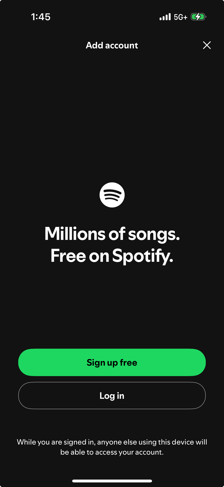

</td>
<td valign="top">

**What I see.** Big dark screen. Spotify logo I recognize. "Millions of songs. Free on Spotify." -- that's a clear promise. Two buttons at the bottom. The green one is loud and obvious: "Sign up free." The other one says "Log in" and is dimmer.

**What I'd do.** Tap **Sign up free**. It's the only bright thing on the screen. No contest. The green button is doing all the work -- the word "free" appears twice (headline and button), which reinforces that this costs nothing. I'm not thinking, I'm just tapping the green thing.

This is a good first screen. One direction, like "right" in 1-1. No decisions to make.

> Show me what happens when I tap "Sign up free."

</td>
</tr>
</table>

---

## Screen 2: Sign Up Options

> *[Screenshot: "Sign up to start listening" with Continue with email, Google, Apple buttons.]*

**What I see.** "Sign up to start listening." Three ways to sign up -- email (green, loud), Google, Apple. Standard stuff. I've seen this pattern on every app.

**What I'd do.** Tap **Continue with Google**. Yeah the green email button is brighter, but I'm lazy and I know Google sign-in means two taps and I'm done. No forms, no passwords.

This screen is fine -- it's a tollbooth, not a teaching moment. No moves to learn here. I just want through it as fast as possible.

> Show me what happens after I authenticate.

---

## Screens 3-4: Account Creation

> *[Screenshots: password creation, name entry, terms.]*

Still the signup tollbooth -- nothing to evaluate here. Skip through all the account creation steps and show me where I land once I'm actually "in" the app.

---

## Screen 5: Artist Picker

<table>
<tr>
<td width="300" valign="top">

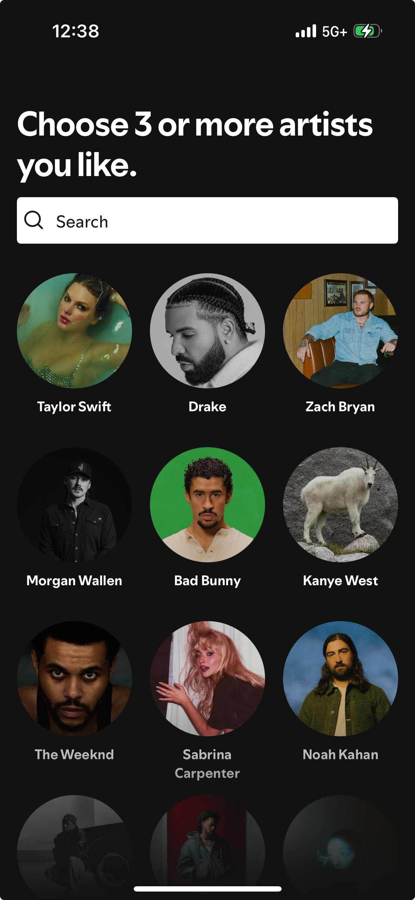

</td>
<td valign="top">

Now we're in it. This is the first real screen after the tollbooth.

**What I see.** "Choose 3 or more artists you like." Big bold text, clear instruction. A search bar. Then a grid of artist photos with names -- Taylor Swift, Drake, Zach Bryan, Morgan Wallen, Bad Bunny, Kanye West, The Weeknd, Sabrina Carpenter, Noah Kahan, more below. The photos are big, circular, tappable-looking. No other buttons or navigation visible -- the whole screen is this one task.

**What I'd do.** I'd tap a few artists I recognize. This is easy -- I know these people, the photos are big, it's basically a game. Tap tap tap. The "3 or more" is a low bar that doesn't feel demanding.

This is a smart screen from a 1-1 perspective. It's doing two things at once:

1. **Teaching the concept of "Spotify knows what I like"** -- I'm telling it my taste, so I'm implicitly learning this is a personalized service. Taught by doing, not by reading.
2. **It's my first investment action.** I just put something *into* this service. It's small, but it's mine now. Switching cost goes up by a tiny amount.

The search bar is also quietly teaching me that search exists and works for finding artists -- a surface I'll need later.

One concern: there's no obvious way to skip this. What if I don't want to pick? Is there a "skip" or does a button appear after I pick three?

> Show me what happens after I tap three artists. Does a "Done" button appear? Or does it auto-advance?

</td>
</tr>
</table>

---

## Screen 6: Artist Picker Responds

<table>
<tr>
<td width="300" valign="top">

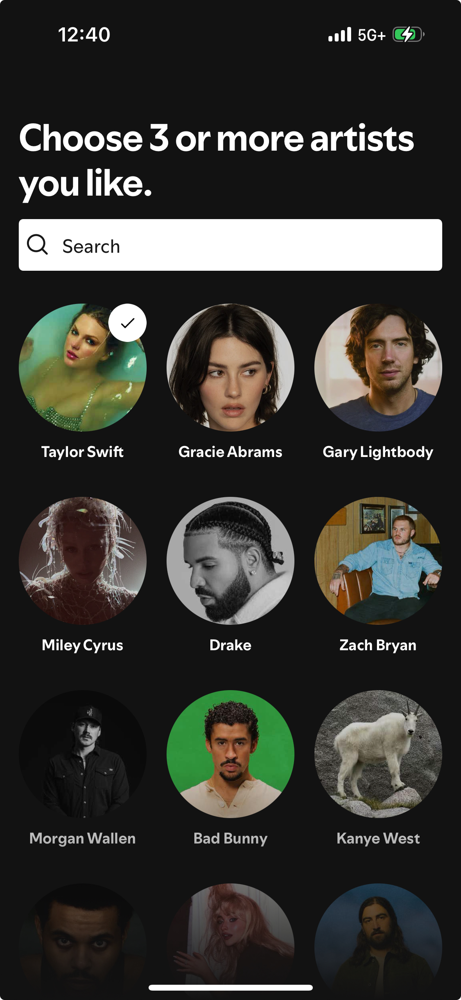

</td>
<td valign="top">

**What I see.** I tapped Taylor Swift -- she's got a checkmark now, and the grid reshuffled. New artists appeared (Gracie Abrams, Gary Lightbody, Miley Cyrus) that feel related to Taylor Swift. The grid is responding to my choices in real time. Still says "Choose 3 or more" and I've only picked one. No "Done" button visible yet.

That's interesting -- the grid is teaching me that Spotify understands artist relationships. I tapped Taylor Swift and got Gracie Abrams, which makes sense if you know indie-pop-adjacent artists. I'm learning "this thing knows music" without anyone telling me.

**What I'd do.** Keep tapping. I'd pick Drake and Bad Bunny to hit my three. I'm curious whether a "Done" button appears at that point.

> Tap two more and show me -- does a button appear after three, or does something else happen?

</td>
</tr>
</table>

---

## Screen 7: Done and Choose Podcasts

<table>
<tr>
<td width="300" valign="top">

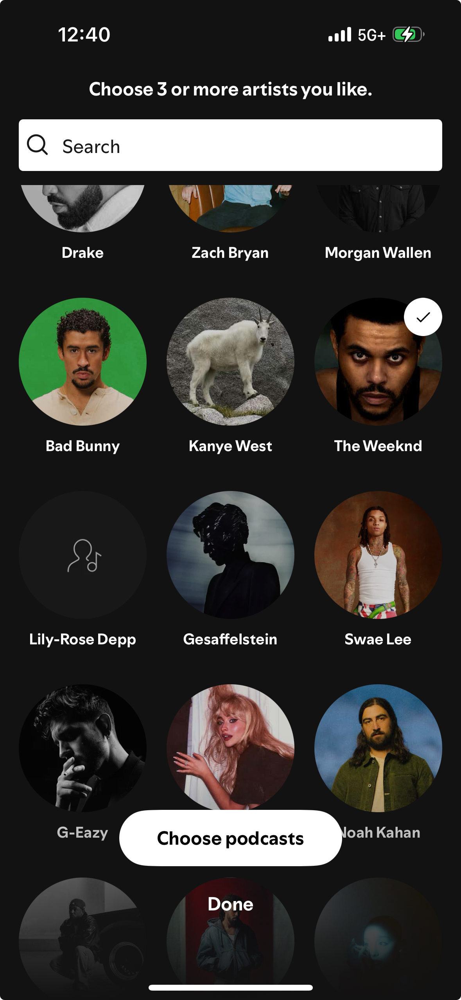

</td>
<td valign="top">

**What I see.** I've scrolled down -- The Weeknd has a checkmark. The grid keeps reshuffling with related artists -- Gesaffelstein, Swae Lee, G-Eazy are all Weeknd-adjacent. At the bottom, two buttons appeared: **"Choose podcasts"** (white, outlined) and **"Done"** (text only, below it, barely visible).

**What I'd do.** I'd tap **Done**. I don't care about podcasts right now -- I came here for music, the first screen told me "millions of songs," and I want to get to the songs. "Choose podcasts" feels like a side quest. I'm not even sure what podcasts have to do with a music app. I'd scroll right past it.

Interesting design note: "Done" is visually the weakest element on this screen -- it's just text, not even a button, partially cut off at the bottom. "Choose podcasts" is louder. That's a deliberate nudge toward podcasts, but as a confused new user, I'm not biting. I want the thing I signed up for.

> Show me what happens when I tap "Done."

</td>
</tr>
</table>

---

## Screen 8: Great Picks -> Start Listening

> **Human:** *[Sends four screenshots showing the animation sequence.]*

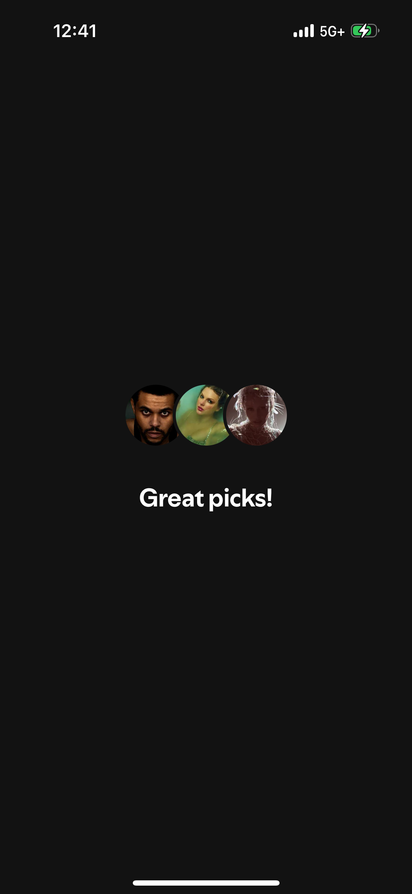 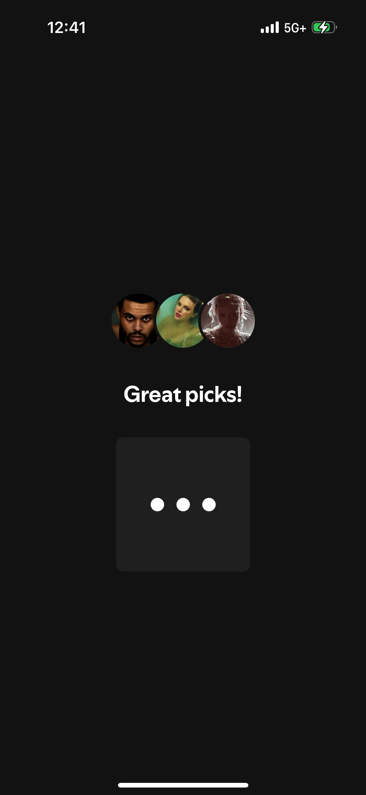 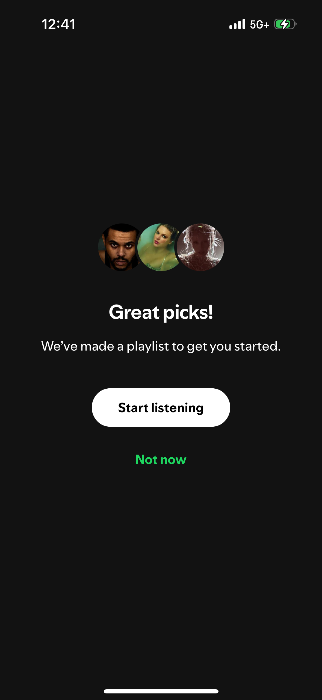

Nice, I can see the sequence. "Great picks!" with my three artists, then a loading state with dots, then it resolves into "We've made a playlist to get you started." with **"Start listening"** and a green "Not now" below.

**What I see.** This is a critical moment. The app is connecting my input (artists I picked) to an output (a playlist made for me). "We've made a playlist" -- that's the first payoff. I gave you something, you gave me something back. The word "playlist" is introduced naturally here, not as a concept I need to learn, but as a gift I'm receiving.

**What I'd do.** Tap **"Start listening"** without hesitation. It's the only real button. "Not now" is green text, easy to ignore. And the copy is perfect -- it doesn't say "go to your home feed" or "explore your library." It says "start listening." That's what I'm here for. That's the promise from screen one ("millions of songs") being delivered.

This is a good goomba. The sequence is: you tell us what you like -> we make something for you -> now listen. Taught by doing. I now understand that Spotify makes things for me based on my taste, and I didn't read a single explanation.

> Show me where "Start listening" takes me.

---

## Screen 9: Home Screen (Music is Already Playing)

> **Human:** The bar at the bottom fades away. "Unwritten" is playing.

<table>
<tr>
<td width="300" valign="top">

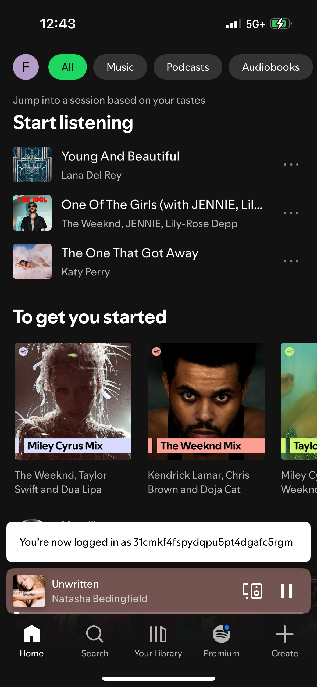

</td>
<td valign="top">

This is the big moment. A lot just happened.

**What I see.** Music is already playing -- "Unwritten" by Natasha Bedingfield is in a bar at the bottom with a pause button. I didn't tap a song. It just started. That's bold -- the app made a decision for me and the core promise ("play music") is being delivered *without me doing anything else*.

Above that, the home screen. Top bar has filter pills: All (green/active), Music, Podcasts, Audiobooks. Then:
- **"Start listening"** -- a short list of songs with album art and three-dot menus. The subtitle says "Jump into a session based on your tastes."
- **"To get you started"** -- horizontal scrollable cards of mixes named after my artists. "Miley Cyrus Mix," "The Weeknd Mix," a third getting cut off.
- Bottom nav: **Home, Search, Your Library, Premium, Create**

**What I'd do.** Honestly? Nothing. Music is already playing. I might just... listen. The app just did the thing I came for without requiring another tap. That's remarkable.

What I'm learning on this screen (all by doing, not reading):
- Music plays automatically -- I don't have to figure out how
- There's a **now-playing bar** at the bottom -- a surface I'll use forever
- Spotify made **mixes for me** based on my picks
- Bottom nav tells me the app has **Home, Search, Library, Create**

The one thing I notice: **I haven't been taught how to play a specific song I want.** Music is playing, but *I* didn't choose it.

> I'd keep listening for a bit, then probably tap one of the songs in the list, or tap Search. Which would you like to show me?

</td>
</tr>
</table>

---

## Screen 10: Tapped a Song

> **Human:** I tapped the first song on the list.

<table>
<tr>
<td width="300" valign="top">

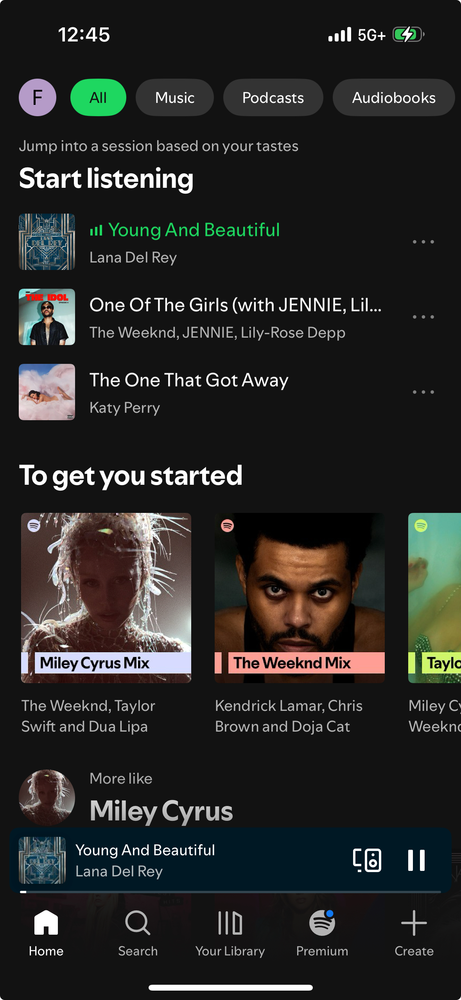

</td>
<td valign="top">

**What I see.** "Young And Beautiful" is now playing -- the title turned green with a little equalizer animation next to it. The now-playing bar at the bottom updated to show it. A new section appeared at the bottom: **"More like Miley Cyrus"** -- the app is already generating more recommendations.

I just learned something important: **tap a song, it plays.** That's the core move. It was effortless -- no confirmation dialog, no intermediate screen. Tap -> music. The green highlight and equalizer icon reinforce "this is the one playing right now."

But here's what I notice: **I still haven't chosen a song myself.** I tapped a song from a list Spotify made for me. I've proven I can tap-to-play, but I haven't proven "I can play *any* song I want."

**What I'd do.** I'm on autopilot, music is playing, this feels good. I'd probably scroll down a bit to see what else is on the home screen. Or I might tap the **now-playing bar** -- it feels tappable and I'm curious.

> Show me whichever you think is more interesting -- what happens if I tap the now-playing bar, or what's further down the home screen?

</td>
</tr>
</table>

---

## Screen 11: Home Scrolled + Now Playing

> **Human:** Here's both -- first is scrolled, then I tapped.

<table>
<tr>
<td width="300" valign="top">

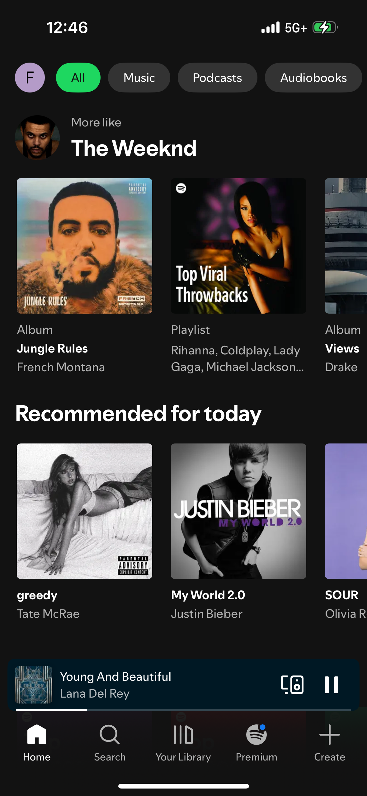

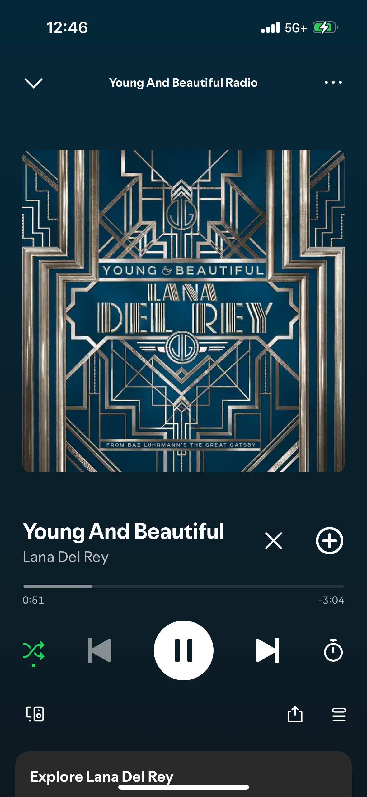

</td>
<td valign="top">

**Scrolled home screen.** "More like The Weeknd" -- albums (French Montana's Jungle Rules, Drake's Views) and a Spotify playlist (Top Viral Throwbacks). Then "Recommended for today" -- Tate McRae, Justin Bieber, Olivia Rodrigo. The home feed is a buffet of personalized content. Albums vs. playlists are labeled, which subtly teaches me those are different things.

**Now-playing screen.** This is the real one. Big album art, gorgeous. Title and artist. A progress bar (0:51 / -3:04). Transport controls: shuffle (green, active), previous, pause, next, and a timer icon.

Two critical things I notice:

1. **The (+) button** next to the song title. That's a save/add action -- my first opportunity for an investment action. But I don't know what it does. Add to what? A playlist? My library? It's just a circle with a plus. As a confused user, I'd probably ignore it.
2. **"Young And Beautiful Radio"** at the top. This tells me I'm not listening to a playlist -- I'm in a "radio" mode. The word "radio" is familiar from the real world, so I roughly get it: it'll keep playing similar songs.
3. **"Explore Lana Del Rey"** peeking at the bottom -- a nudge to go deeper into the artist.

**What I'd do.** I've been on the now-playing screen for a bit. I've learned: play, pause, skip. The music is good. I'd **swipe down** to dismiss the player and go back. At this point I'm starting to get curious -- can I find a *specific* song? That **Search** tab has been sitting there since I arrived.

> Show me the Search tab.

</td>
</tr>
</table>

---

## Screen 12: Search

<table>
<tr>
<td width="300" valign="top">

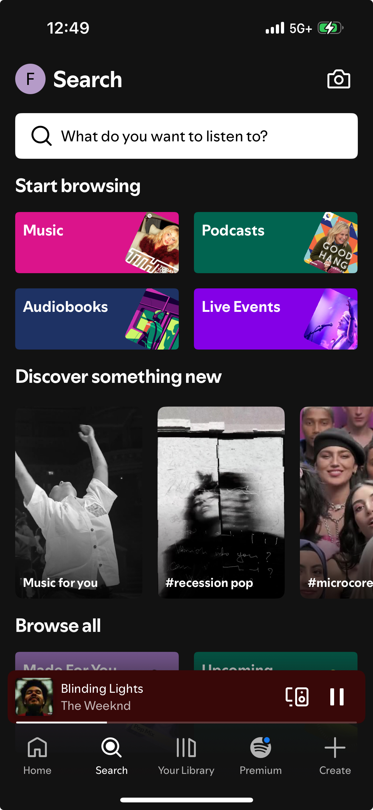

</td>
<td valign="top">

**What I see.** "Search" at the top, and immediately below it: **"What do you want to listen to?"** -- that's the most important sentence on this screen. It's the on-demand promise in plain language. A search bar, ready to go.

Below that, "Start browsing" with four colorful category cards: Music (pink), Podcasts (teal), Audiobooks (blue), Live Events (purple). Then "Discover something new" with genre/mood cards.

Music is still playing in the now-playing bar. It hasn't stopped just because I navigated away -- that's good, I'm learning that navigation and playback are independent.

**What I'd do.** Tap the **search bar** and type a song name. This is the moment of truth for goal number one: can I play any song I want, on demand?

The browsing categories are fine but I'd ignore them. I came here with intent. "What do you want to listen to?" is asking me a direct question, and I have an answer.

> Show me what happens when I search for a specific song.

</td>
</tr>
</table>

---

## Screen 13: Alexa Interruption

<table>
<tr>
<td width="300" valign="top">

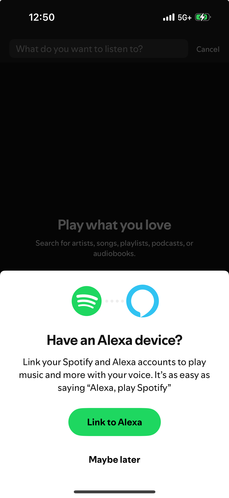

</td>
<td valign="top">

**What I see.** I tapped the search bar and... a modal just popped up over it. **"Have an Alexa device?"** -- Link to Alexa, play music with your voice, etc. A green "Link to Alexa" button and "Maybe later."

This is a goomba on a ledge over a pit. I was *in the middle of doing the most important thing in the product* -- searching for a song to prove I can play anything on demand -- and the app interrupted me with a cross-promotion. I don't care about Alexa right now. I haven't even proven the core product works yet. This is the equivalent of Mario being stopped mid-jump by a popup asking if he wants to buy a different controller.

Behind the modal I can see "Play what you love" and "Search for artists, songs, playlists, podcasts, or audiobooks" -- that's actually helpful copy! But it's grayed out behind an ad.

**What I'd do.** Tap **"Maybe later"** as fast as possible. I'm annoyed. This didn't teach me anything, it broke my flow, and it introduced a concept (cross-device playback, voice control) that I'm not ready for.

> Show me the search after dismissing the Alexa modal.

</td>
</tr>
</table>

---

## Screen 14: Search Empty State

<table>
<tr>
<td width="300" valign="top">

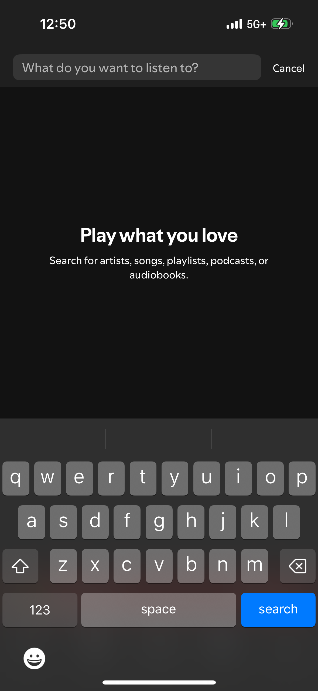

</td>
<td valign="top">

**What I see.** Keyboard up, **"Play what you love"** in the center, and "Search for artists, songs, playlists, podcasts, or audiobooks" below. The search bar says "What do you want to listen to?" and there's a "Cancel" option.

**What I'd do.** Type a song name. I know what I want to hear.

> Show me what happens when I search.

</td>
</tr>
</table>

---

## Screen 15: Search Results

<table>
<tr>
<td width="300" valign="top">

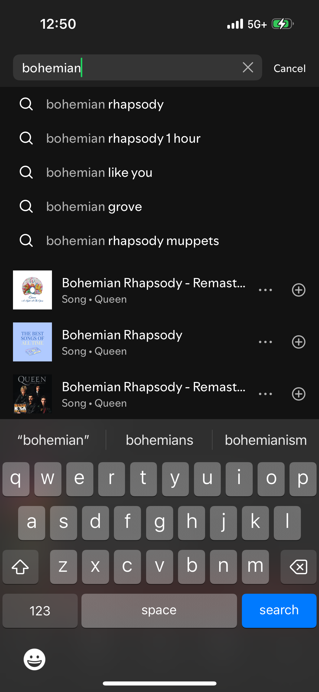

</td>
<td valign="top">

**What I see.** I typed "bohemian" and instantly got autocomplete suggestions ("bohemian rhapsody" at the top) plus actual song results below -- three versions of "Bohemian Rhapsody" by Queen with album art, three-dot menus, and (+) buttons on each.

This is the moment. **The on-demand promise is proven.** I thought of a song, I typed a few letters, and there it is. I haven't even finished typing. The song exists, it's right there, and I already know from earlier that tapping a song plays it.

**What I'd do.** Tap **"Bohemian Rhapsody - Remast..."** -- the first result. I know what happens: it plays. I learned that move on the home screen.

And I notice the (+) buttons again -- here in search results, same icon as on the now-playing screen. It's appearing consistently, which means when I eventually tap it, I'll recognize it as the same action everywhere. That's a good bridge.

This is goal number one complete: **I can play any song I want, on demand.** Search -> type -> tap -> music. Four steps, zero confusion.

We're probably approaching the natural end of a first session. The user has: signed up, picked artists, heard auto-played music, tapped a song, skipped tracks, navigated to search, and found a specific song. That's a solid first session.

> Do you want to show me one or two more screens, or should I do the coverage report?

</td>
</tr>
</table>

---

> **Human:** Do the coverage report.

---

## First Coverage Report

### The Moves

| # | Move | Status | Notes |
|---|------|--------|-------|
| 1 | Play a song | ✅ | Auto-played on arrival, then tapped a song and it played instantly. Learned twice -- passively then actively. |
| 2 | Search for a song | ✅ | Search tab was obvious, autocomplete made it effortless. The Alexa modal nearly ruined this moment. |
| 3 | Control playback | ✅ | Pause/skip are standard transport icons. Scrubbing the progress bar is a universal mobile pattern. |
| 4 | Save/add a song | 🌉 | The (+) appeared on the now-playing screen and again in search results. Saw it at least three times but never tapped it. The surface is established -- when I'm ready, I'll recognize it. But a confused user may never discover this on their own. |
| 5 | Create a playlist | ❌ | "Create" exists in the bottom nav but nothing nudged me toward it. I don't know what it does. |
| 6 | Navigate between sections | ✅ | Bottom nav was always visible. Naturally moved between Home and Search. |
| 7 | Browse recommendations | ✅ | Home feed full of personalized content, organized by artist picks. |
| 8 | Access song options | 🌉 | Three-dot menus appeared on every song row. Never tapped one, but I know they're there. Standard mobile pattern. |
| 9 | Use the now-playing bar | ✅ | Appeared automatically when music started. Tapped it and the player expanded. Swiping down dismissed it. |
| 10 | Share a song | 🌉 | Share icon visible on the now-playing screen. Standard iOS share icon. |

### Summary

- ✅ Taught by design: **5**
- 🌉 Bridge in place: **3**
- ❌ Never taught: **1**
- ⚠️ Taught by words: **0**
- 🔇 Taught but never needed: **0**

### The 1-1 Question

> After their first session, can this user play forever without learning anything new?

**Almost.** The core loop is solid -- I can find music and play it. I can browse and discover. If I come back tomorrow, I know exactly what to do: open the app, music is probably there, or go to Search and find something.

But **goal number two -- taking an investment action -- didn't happen.** I never saved a song or created a playlist. The (+) was visible but never explained itself through design. No moment in the flow naturally led me to tap it.

This matters for retention. Without an investment action, there's nothing pulling me back to *Spotify specifically.* I proved I can play any song -- but I could do that on YouTube too. The thing that makes Spotify sticky is *my stuff is here* -- my playlists, my saved songs, my taste profile. And I walked away from session one with none of that (except the artist picks, which I'll never see again).

---

> **Human:** OK, I'll tap (+) to show what happens. I tapped plus and got the modal. I also tapped "New playlist." When I'm done I'm back on the now-playing view.

---

## Screen 16: Saving a Song and Creating a Playlist

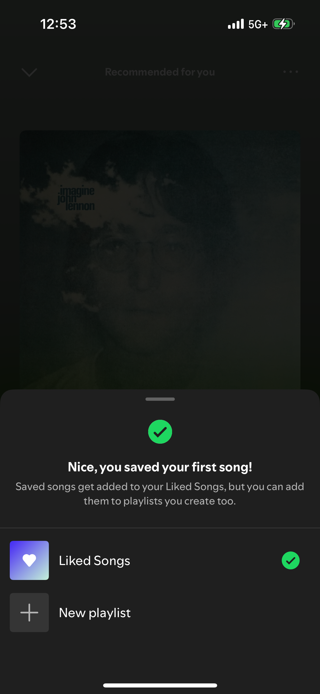 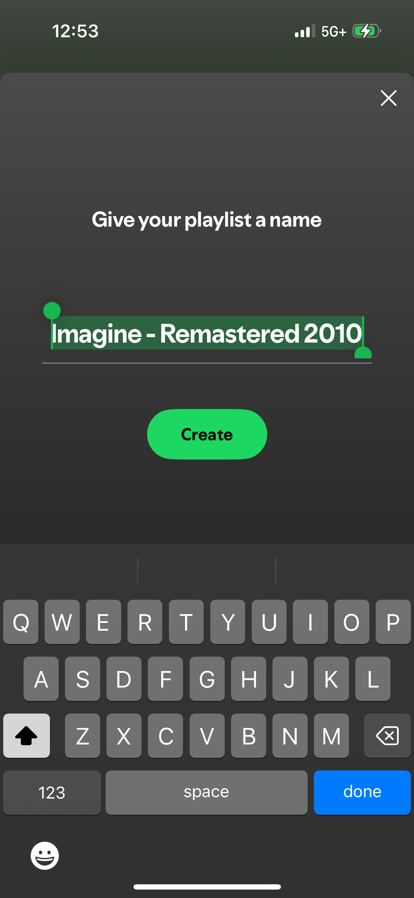 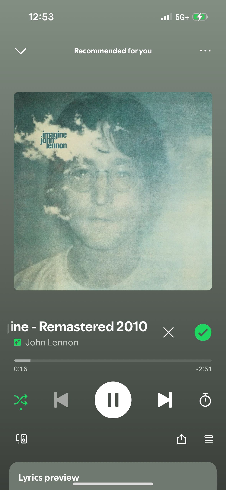

Oh, this changes my report.

That first modal is actually excellent. **"Nice, you saved your first song!"** -- it celebrates the action, explains what just happened ("Saved songs get added to your Liked Songs"), *and* immediately offers the next move ("but you can add them to playlists you create too"). Liked Songs already has a green checkmark -- the save happened automatically. And "New playlist" is right there.

Then the playlist creation -- "Give your playlist a name," pre-filled with the song title, one "Create" button. Dead simple. And back on the now-playing screen, the (+) has become a **green checkmark** -- visual confirmation that this song is saved.

This changes the coverage on two moves:

- **Save/add a song**: Still a 🌉 in terms of the *first session flow leading you to it* -- nothing nudged me to tap (+). But *when* you tap it, the teaching is ✅ perfect.
- **Create a playlist**: Upgrades from ❌ to 🌉. The path exists -- it's one tap from the save modal. The bridge is the save action itself.

But there are two gaps here, not one:

**Gap one: nothing nudges you to tap (+) the first time.** The teaching *after* the tap is great. The problem is getting to the tap. That first-tap nudge is the missing goomba.

**Gap two: where did my playlist go?** I created a playlist, and I'm back on the now-playing screen like nothing happened. There's no confirmation of where it lives, no link to go see it, no nudge toward "Your Library." I did an investment action -- the most important thing for retention -- and the product just swallowed it. I'm back to the player like nothing happened.

A confused user would think: "Did that work? Where is it? How do I find it later?" And they might not bother trying again.

That's not about teaching a move -- it's about **closing the loop on an action the user just took.** Mario doesn't let you hit a block and wonder where the coin went. You see the coin, you hear the sound, the counter goes up. Here, you created a playlist and got... nothing.

---

## Final Coverage Report

| # | Move | Rating | Notes |
|---|------|--------|-------|
| 1 | Play a song | ✅ | Auto-played on arrival, then tapped a song and it played instantly. Learned twice. |
| 2 | Search for a song | ✅ | Search tab was obvious, autocomplete made it effortless. |
| 3 | Control playback | ✅ | Pause/skip are standard icons. Universal mobile pattern. |
| 4 | Navigate sections | ✅ | Bottom nav always visible. Naturally moved between Home and Search. |
| 5 | Browse recommendations | ✅ | Home feed full of personalized content, organized by artist picks. |
| 6 | Use the now-playing bar | ✅ | Appeared automatically. Tapped to expand, swiped to dismiss. |
| 7 | Save a song | 🌉 | (+) appeared on every song but nothing nudged me to tap it. When I did, teaching was great. |
| 8 | Create a playlist | 🌉 | Path exists from the save modal. Bridge is the save action itself. |
| 9 | Find saved songs / playlists | 🔓 | **Open loop.** Saved a song and created a playlist, but the product never showed where they went. |
| 10 | Song options menu | 🌉 | Three-dot menus visible on every song row. Standard pattern. |
| 11 | Share a song | 🌉 | Share icon visible on now-playing screen. Standard iOS icon. |

### Summary

- ✅ Taught by design: **6**
- 🌉 Bridge in place: **4**
- 🔓 Open loop: **1**
- ❌ Never taught: **0**
- ⚠️ Taught by words: **0**

### The 1-1 Question

> After their first session, can this user play forever without learning anything new?

**Almost.** The core loop is solid -- find music and play it. Browse and discover. If you come back tomorrow, you know exactly what to do.

But the investment loop didn't close. The user saved a song and created a playlist, and both vanished into the void. They don't know where their stuff lives. Without that, there's nothing pulling them back to *Spotify specifically* -- they proved they can play any song, but they could do that on YouTube too. The thing that makes Spotify sticky is *my stuff is here*, and they walked away not knowing where "here" is.

### What Would Make This a Real 1-1?

**Close the save loop (fix the 🔓).** After the user creates a playlist or saves their first song, briefly show or link to where it lives. Take them to their Liked Songs for a second, or show a toast with "Find this in Your Library" that links there. Now they've learned the Library surface too, and they have a reason to come back.

**Nudge the first save.** After the user has been listening to a song past the halfway mark without skipping, a subtle visual nudge on the (+) -- not a tooltip, not a modal, just a gentle glow or pulse -- could teach "this is tappable" through design rather than requiring them to discover it by accident.

**Kill the Alexa modal.** Interrupting search -- the single most important action for proving the on-demand promise -- with a cross-device promo on day one is a goomba on a ledge over a pit with no run-up. This should be a session-three notification at earliest, or buried in settings.
